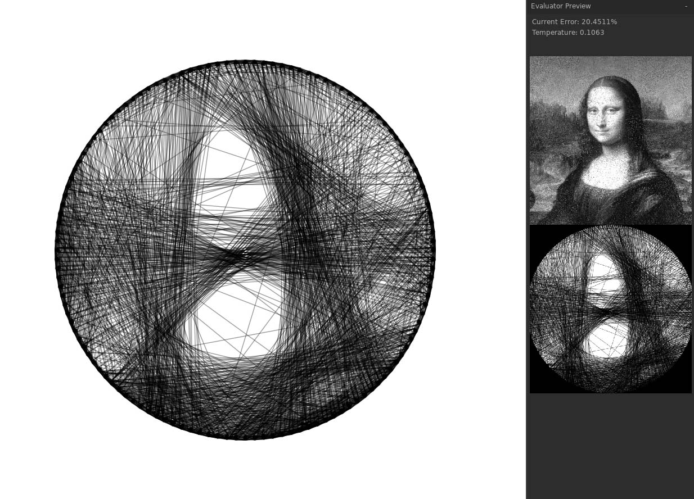

# StringTheory
A thing for turning strings into pictures

## TODO
- **Next step**: Tweaks
  - maybe mess with the evaluation algorithm so it's nicer to colors that are closer together and meaner to ones that are further away (it's already like that, but even more so)
  - treat the wires as translucent so we can fake more subtle distinctions in value
  - have a value being too low punished more strongly than being too high
  - favor states which use fewer strings but result in nearly the same error.
    - this will hopefully stop the overall image from getting to dark as the agent can't figure out the difference when an extraneous string is turned off
  - a lot of time is currently wasted on impossible wires...
  - try setting it to find/prioritize edges (oh boy time to write a sobel filter)
- Load/Save StringStates
- Process a StringState into a series of instructions so the images can be made in real life.
- Usability Improvements
- Aesthetic improvements.
- Massive amounts of refactoring this codebase is a big plate of spaghetti.
- Let the user make edits/toggle individual strings/maybe indicate "important" area of an image.

Each string is identified by its source node (always less than its destination node), its destination node, and type

|`type`|corresponding string|
|---:|-|
|1| "right" outer tangent|
|2| "left" outer tangent|
|3| "right" inner tangent|
|4| "left" inner tangent|

## Limitations
- Can currently only handle images larger than `evaluatorResolution`
- Can also only "correctly" handle images with square aspect ratios
  - Will scale non-square images to be square, rather than crop.
- Hoop size is clipped to the half the height of the screen, which is arbitrary and unnecessary.

uses [LÖVE-Nuklear](https://github.com/keharriso/love-nuklear) for UI