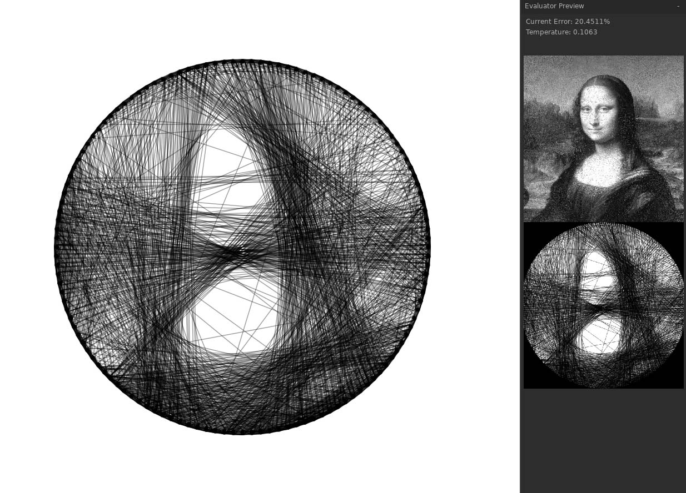
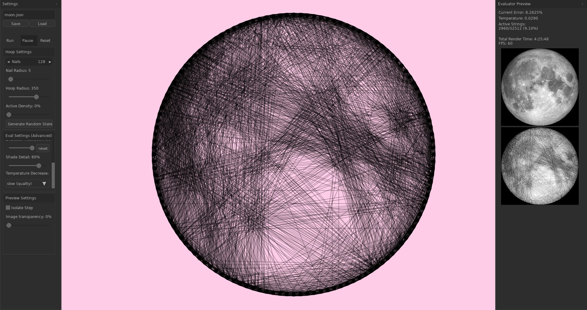

# StringTheory
A toy for turning strings into pictures using simulated annealing

Each string is identified by its source node (always a smaller id than its destination node), its destination node, and `type` (see table)

|`type`|corresponding string|
|---:|-|
|1| "right" outer tangent|
|2| "left" outer tangent|
|3| "right" inner tangent|
|4| "left" inner tangent|

## Limitations
- Can currently only handle images larger than `evaluatorResolution`
- Can also only "correctly" handle images with square aspect ratios
  - Will scale non-square images to be square, rather than crop.
- Hoop size is clipped to the half the height of the screen, which is arbitrary and unnecessary.
- Is almost certainly extremely buggy

## Requirements
- uses [LÖVE-Nuklear](https://github.com/keharriso/love-nuklear) for UI
  - (should only need to download this if you're building it yourself, otherwise it should be packaged with the .exe)